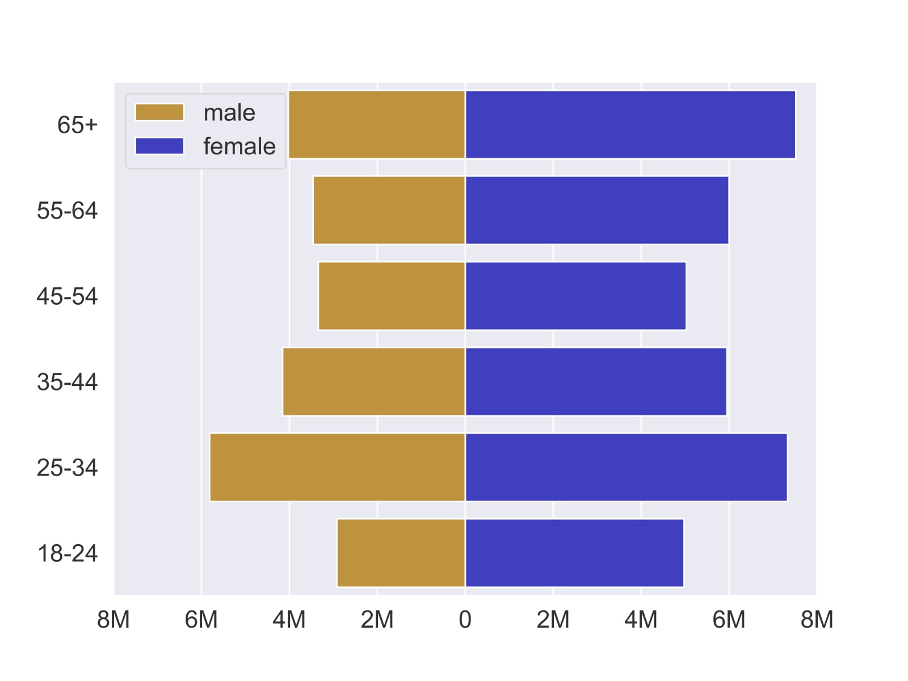
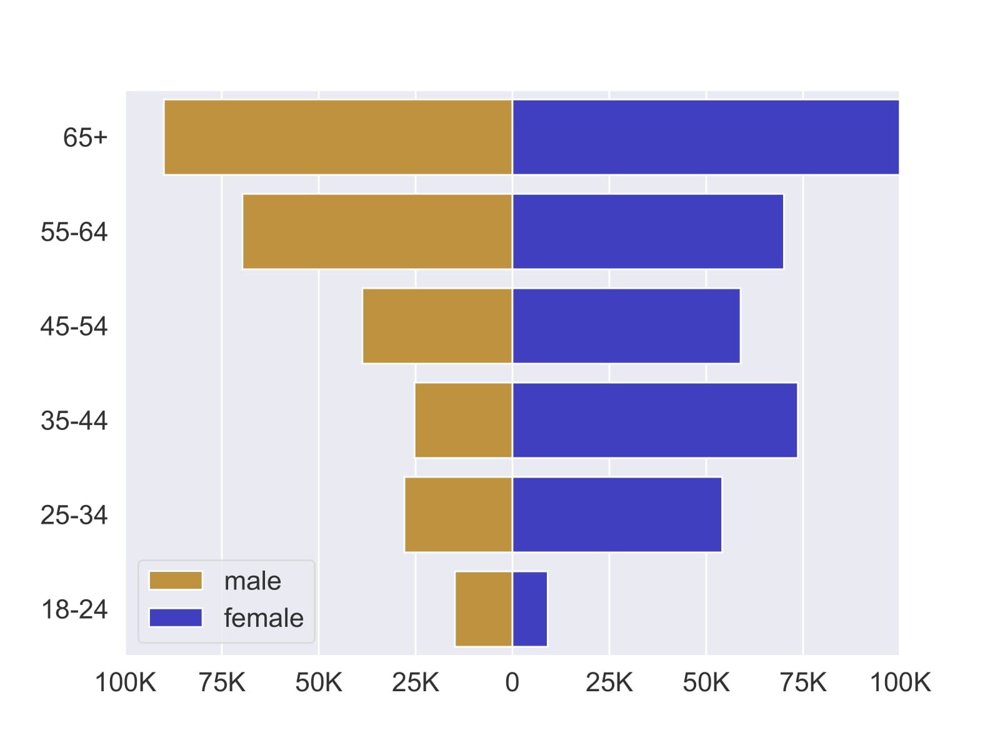
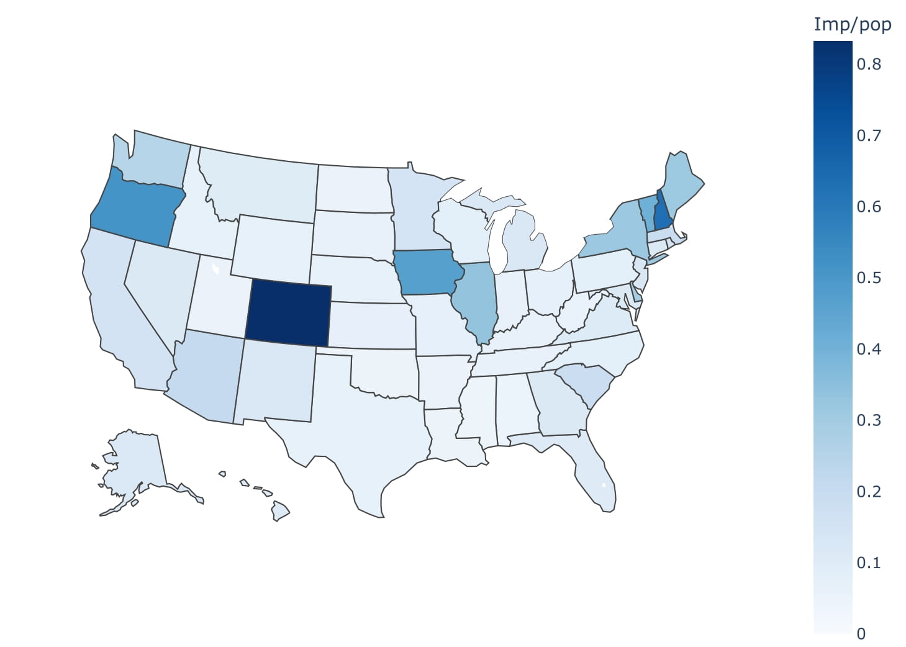
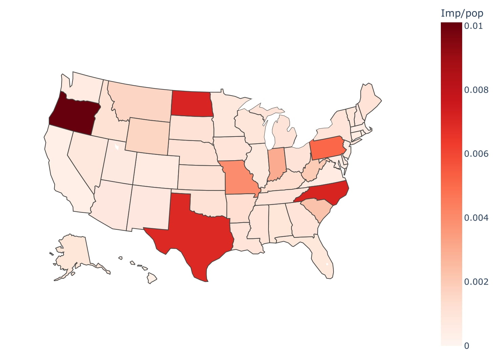

# Political ad analysis

## Description

This project aims to analyze how US politicians talk about climate change on Facebook owned social media advertisements. We are leveraging Facebook's Ad Library, that has been released in May 2018, to answer important questions about social media advertisement strategies in regards to climate change. 

For a full reference, please see our paper: (https://github.com/lrnz-asnprs/political-ad-api/blob/main/How_do_Politicians_Talk_about_Climate_Change.pdf)

## Main results

### Which US congress members were the main climate advertisers on Facebook?


### How do the temporal dynamics of climate related advertisements by US congress members look like?


### How is the demographic distribution of advertisements characterized?



(X-axis represents total impressions generated)


  
(X-axis represents total impressions generated)

### How is the geographic distribution of advertisements characterized?


  
(Impressions generated for each US state normalized by state population size)
  
 
  
(Impressions generated for each US state normalized by state population size)

### Executing program

* Currently under construction
```
code blocks for commands
```


### Zeroshot classifier


We test our keyword search approach against the NLI zeroshot classifier.


    | Zeroshot | Keyword | overlap |
    | ---      | ---     | ---     |
    | 19176    | 18893   | 18876   | 


Keywords approach when compared with zeroshot being the ground truth:

+ None of the false negatives (only 3 distinct texts) are climate related (i.e., the ones that zeroshot labels climate related and keyword does not)
+ 


Available here: https://huggingface.co/facebook/bart-large-mnli?fbclid=IwAR2RbLDin29uYPf_fOIXlwJ5E7xJS3Nyxcn5a_yN-m-ImAxvaS8gvhLl3Uk


## Authors

Laurenz Aisenpreis, Gustav Gyrst
